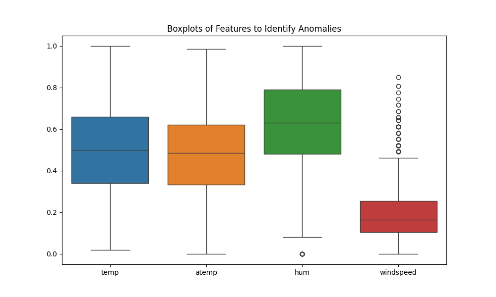
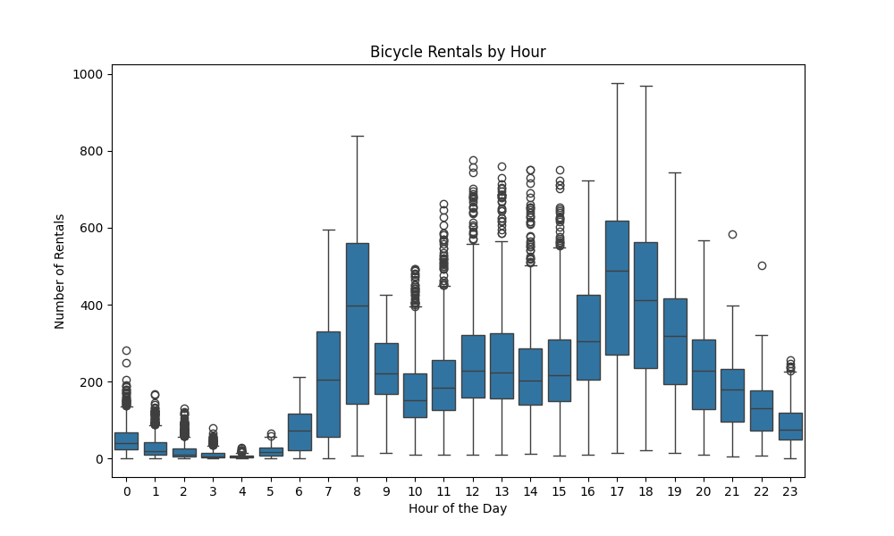
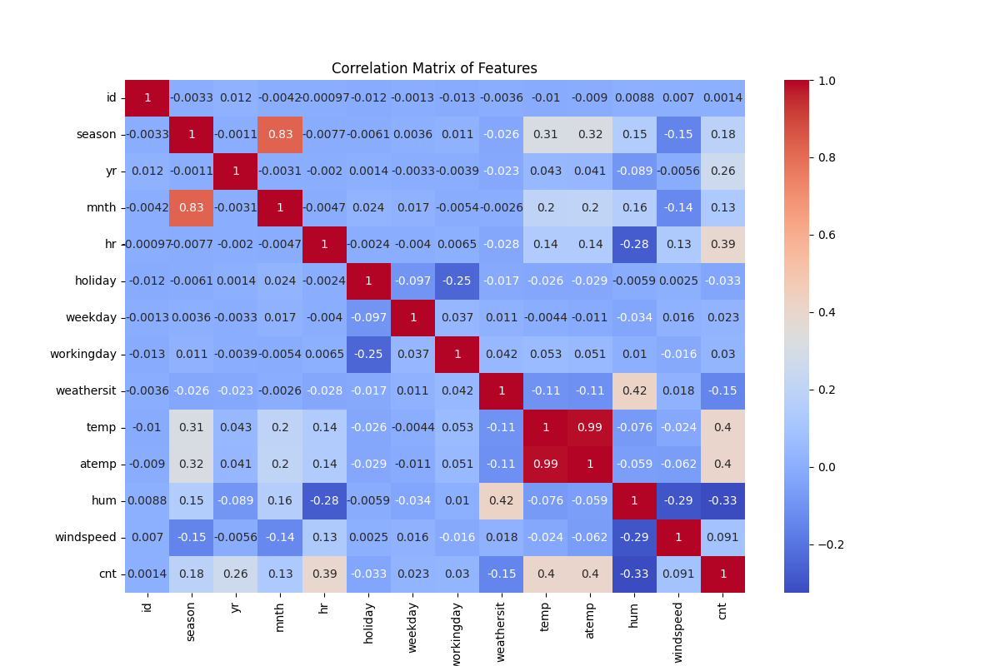

# 🚲 Bicycle Rental Prediction Project

## 🧠 Introduction

The goal of this project is to predict the number of bicycle rentals per hour based on features such as weather conditions, time of day, and seasonal factors. Accurate forecasting can assist in resource planning, station balancing, and infrastructure decisions for bike-sharing systems.

---

## 🔍 At a Glance

| Item               | Details                                   |
|--------------------|-------------------------------------------|
| Task               | Regression – Predict hourly bike rentals  |
| Dataset            | Kaggle – Proton X TF09 Competition        |
| Algorithms         | Neural Network, LightGBM, XGBoost, RF     |
| Evaluation Metrics | MAE, RMSE                                 |
| Tools              | Python, Scikit-learn, TensorFlow, LightGBM|

---

## 🗂️ Project Structure
```bash
bicycle-rental-prediction/
├── data/                                 # Raw & processed datasets
├── plots/                                # Visual output directories
│   ├── eda/
│   ├── visualization/
│   └── statistical_analysis/
├── src/                                  # Source code scripts
│   ├── data_preprocessing.py
│   ├── eda.py
│   ├── modeling.py
│   ├── train_and_evaluate.py
│   ├── predict.py
│   ├── visualization.py
│   └── statistical_analysis.py
├── requirements.txt
├── README.md                             # This file
└── .gitignore
```

---

## 🎯 Motivation
Accurate prediction of bicycle rentals can help in:
- Optimizing inventory of bicycles at stations
- Predicting peak usage periods
- Supporting decision-making for city planners

---

## ⚙️ Environment Setup

```bash
# 1. Clone the repository
$ git clone https://github.com/juliemai16/bicycle-rental-prediction.git
$ cd bicycle-rental-prediction

# 2. Create and activate a virtual environment
$ python -m venv venv
$ source venv/bin/activate  # Windows: venv\Scripts\activate

# 3. Install dependencies
$ pip install -r requirements.txt
```

---

## 📊 Dataset Overview

The dataset includes hourly data for two years with the following features:

- `season`, `yr`, `mnth`, `hr`, `holiday`, `weekday`, `workingday`
- `weathersit`, `temp`, `atemp`, `hum`
- `cnt` – total rental count (target)



### Preprocessing Steps
- Handling missing values (if any)
- Feature scaling and encoding
- Train-test splitting

---

## 🔎 Exploratory Data Analysis (EDA)



EDA was performed to understand trends, patterns, and relationships:
- Distribution of hourly rentals
- Impact of weather and holidays
- Peak usage by hour/day/month

📁 Scripts: `src/eda.py`  
📷 Output: `plots/eda/`

---

## 📊 Data Visualization

Visualizations helped validate assumptions and identify nonlinear trends:
- Correlation heatmaps
- Line plots of rentals over time
- Bar charts comparing rentals by season/hour

📁 Script: `src/visualization.py`  
📷 Output: `plots/visualization/`

---

## 📈 Statistical Analysis

Statistical tests were used to:
- Determine feature importance
- Understand significant seasonal/temporal effects

📁 Script: `src/statistical_analysis.py`  
📷 Output: `plots/statistical_analysis/`



---

## 🤖 Modeling Approach

We implemented multiple ML models and compared performance:

### Algorithms Used
- ✅ TensorFlow Neural Network
- ✅ LightGBM, XGBoost, Gradient Boosting
- ✅ Random Forest

### Training Workflow
- Data split (train/validation)
- Cross-validation & hyperparameter tuning
- Early stopping (for neural network)

### Evaluation Metrics
- **MAE** (Mean Absolute Error)
- **RMSE** (Root Mean Squared Error)

📁 Script: `src/train_and_evaluate.py`

---

## 📦 Deployment

### Prediction on New Data

```bash
# 1. Ensure preprocessed data exists
# 2. Run prediction script
$ python src/predict.py
```
Predictions are saved to `data/submissionDataset_with_predictions.csv`

---

## 📈 Results & Discussion

### Evaluation Summary
- LightGBM and XGBoost outperformed baseline models
- Neural Network performed well but was sensitive to hyperparameters
- Clear patterns detected based on weather and time-of-day features

### Key Insights
- Weather, hour, and working day status are strong predictors
- Holidays decrease rental volume except during certain seasons

---

## 🧭 Future Work

- Test time-series-based models (e.g., LSTM, Prophet)
- Include external events or real-time weather feeds
- Deploy as an API using FastAPI

---

## 🤝 Contributing

```bash
# To contribute:
1. Fork this repo
2. git checkout -b feature/your-feature-name
3. Commit & push your changes
4. Open a pull request 🎉
```

---

## 🪪 License
This project is licensed under the MIT License. See the [LICENSE](LICENSE) file.
